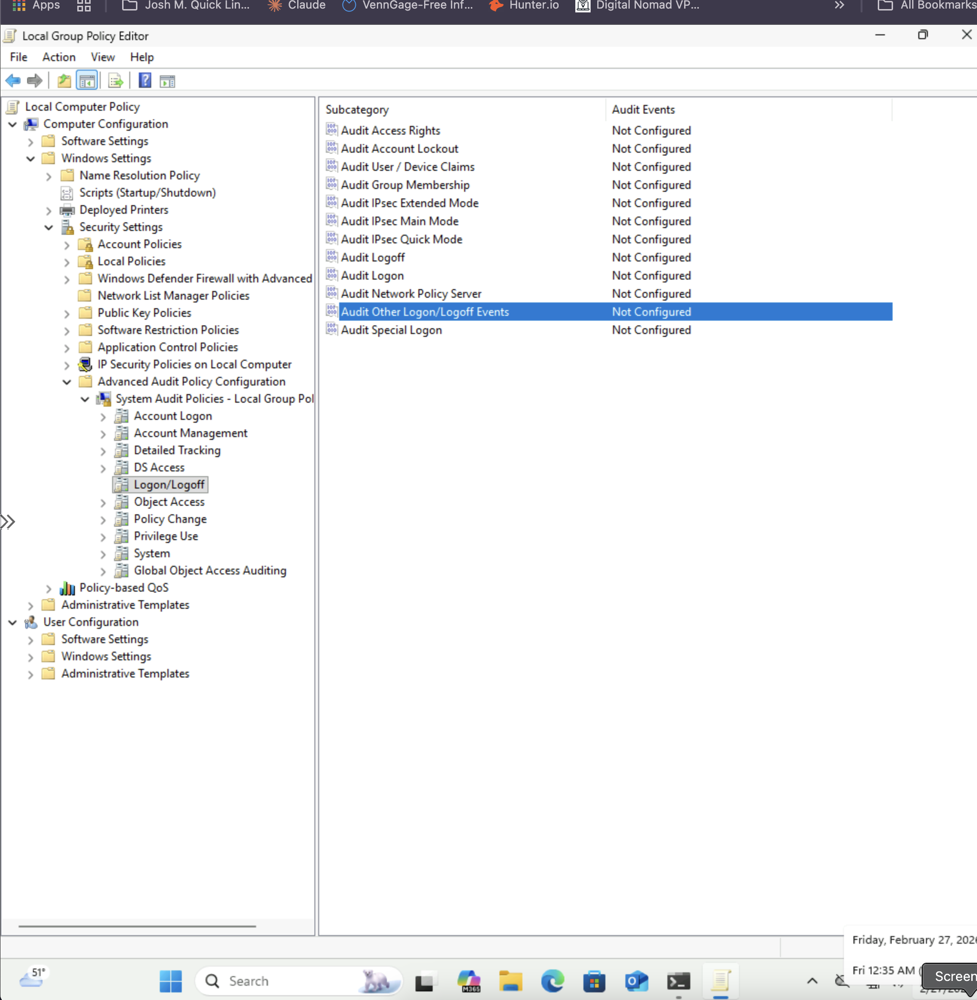
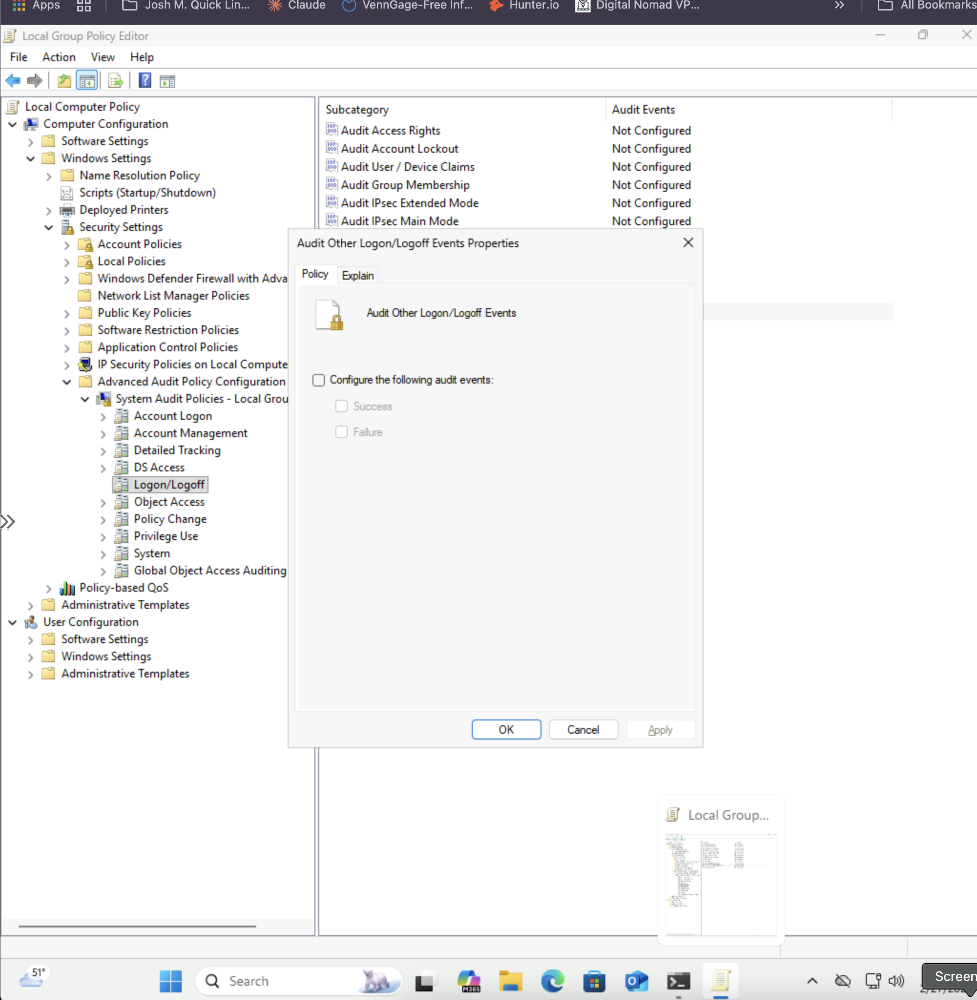
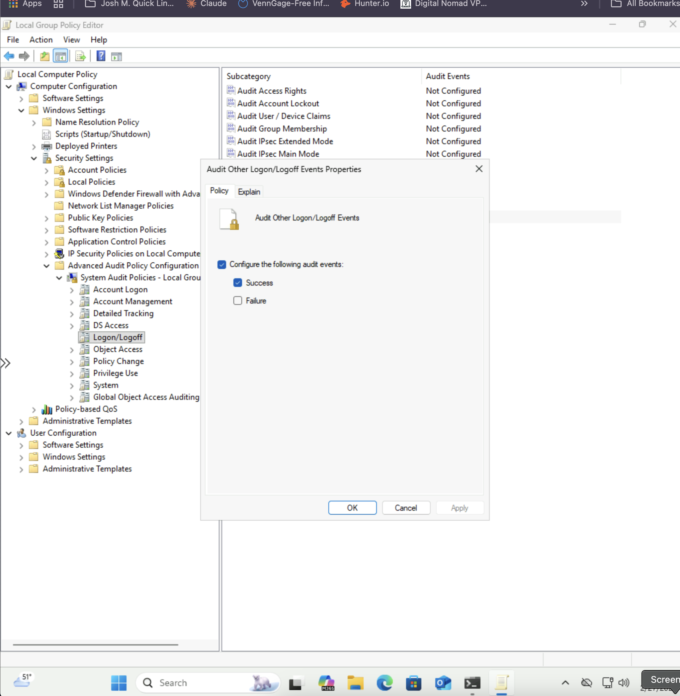
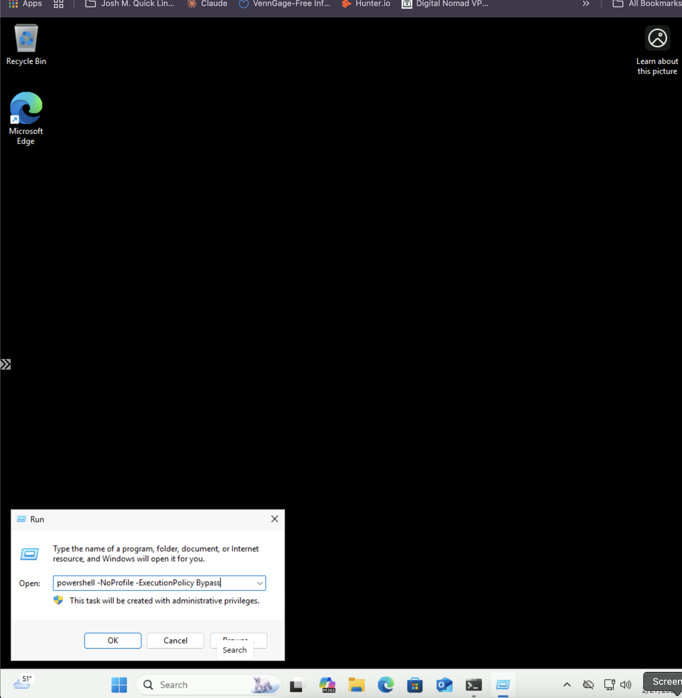
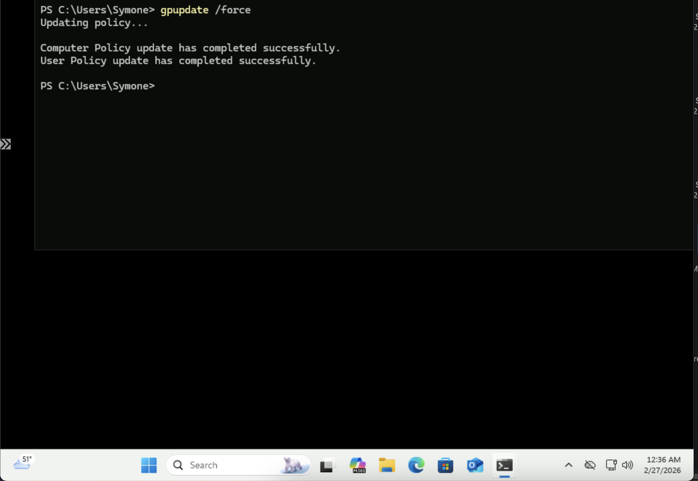
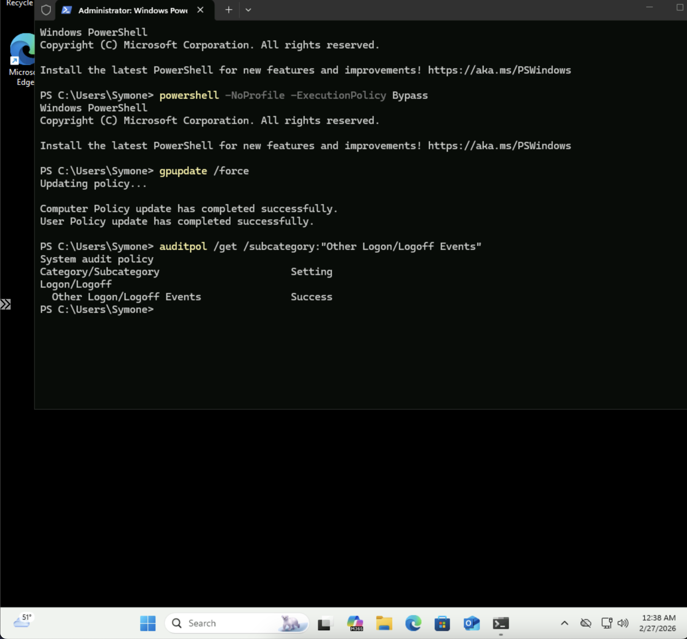
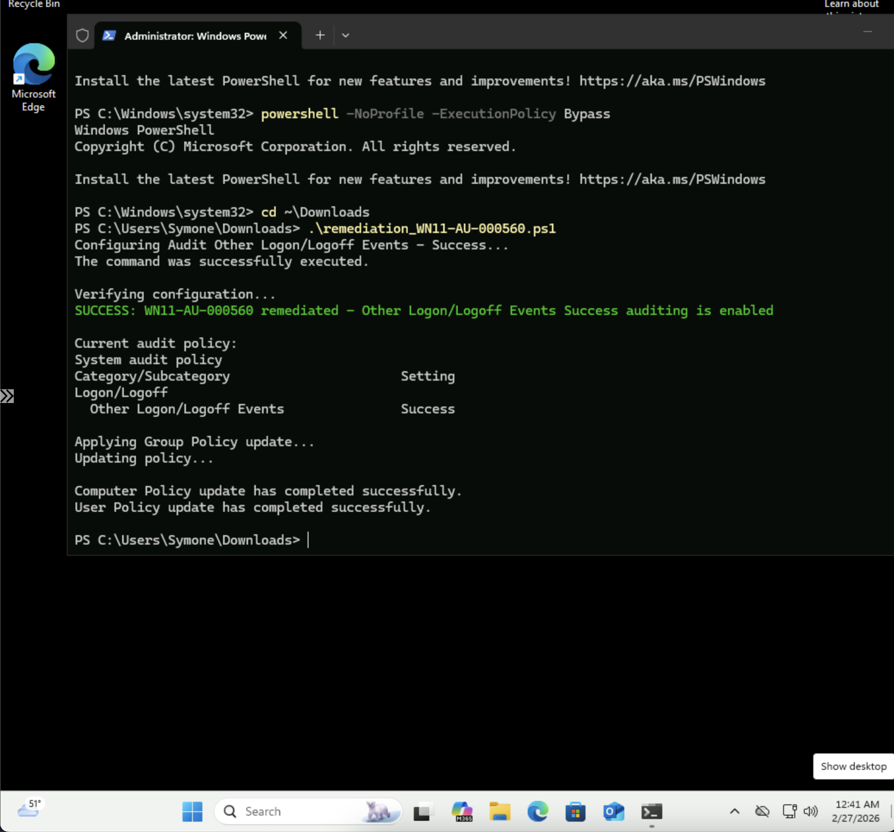

# Windows STIG WN11-AU-000560 Remediation
## Overview
This repository contains remediation for STIG vulnerability WN11-AU-000560: "Windows 11 must be configured to audit other Logon/Logoff Events Successes."
## Vulnerability Details
- **STIG-ID**: WN11-AU-000560
- **Vuln-ID**: V-253345
- **Severity**: CAT II
- **Description**: Maintaining an audit trail of system activity logs can help identify configuration errors, troubleshoot service disruptions, and analyze compromises. Auditing Other Logon/Logoff Events captures additional authentication activity such as credential validation, network logons, and session reconnections that are not captured by the standard Logon/Logoff audit category.
## Remediation Methods
### Automated (PowerShell Script)
Run the `remediation_WN11-AU-000560.ps1` script as Administrator to automatically enable Other Logon/Logoff Events Success auditing.
**To run:**
```powershell
PS C:\> .\remediation_WN11-AU-000560.ps1
```
### Manual (Group Policy Editor)
1. Open Local Group Policy Editor (`gpedit.msc`)
2. Navigate to: `Computer Configuration` → `Windows Settings` → `Security Settings` → `Advanced Audit Policy Configuration` → `System Audit Policies` → `Logon/Logoff`
3. Double-click **"Audit Other Logon/Logoff Events"**
4. Check **"Configure the following audit events"**
5. Check **"Success"**
6. Click **Apply** → **OK**
7. Open PowerShell as Administrator and run: `gpupdate /force`
8. Verify with: `auditpol /get /subcategory:"Other Logon/Logoff Events"`
## Screenshots
### Before - Policy Not Configured

### During - Policy Dialog Open

### After - Success Auditing Enabled

### PowerShell NoProfile Launch

### Manual - GPUpdate and Verification

### Manual - AuditPol Verification

### PowerShell Automated Remediation Success

## Testing Information
- **Tested By**: Symone-Marie Priester
- **Date Tested**: February 26-27, 2026
- **System**: Windows 11 (Version 10.0.26200.7623)
- **PowerShell Version**: 5.1
- **Methods**: Both automated (PowerShell) and manual (Group Policy Editor)
## Repository Structure
```
├── remediation_WN11-AU-000560.ps1                      # PowerShell remediation script
├── WN11-AU-000560_AuditLogonLogoff_Before.png           # Before - policy not configured
├── WN11-AU-000560_AuditLogonLogoff_Dialog_Before.png    # During - dialog open
├── WN11-AU-000560_AuditLogonLogoff_Success_Enabled.png  # After - success enabled
├── WN11-AU-000560_PowerShell_NoProfile_Launch.png       # PowerShell launch method
├── WN11-AU-000560_gpupdate_Manual_Verification.png      # Manual - gpupdate success
├── WN11-AU-000560_AuditPol_Manual_Verification.png      # Manual - auditpol verification
├── WN11-AU-000560_Programmatic_Remediation.png          # PowerShell remediation success
└── README.md                                             # This file
```
## Author
**Symone-Marie Priester**
- LinkedIn: [linkedin.com/in/symone-mariepriester](https://linkedin.com/in/symone-mariepriester)
- GitHub: [github.com/Symone-Marie](https://github.com/Symone-Marie)
